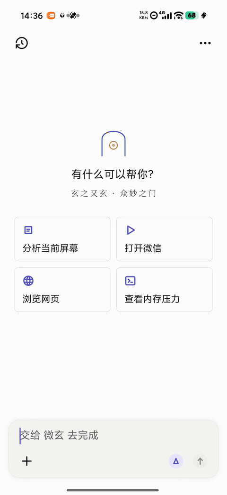
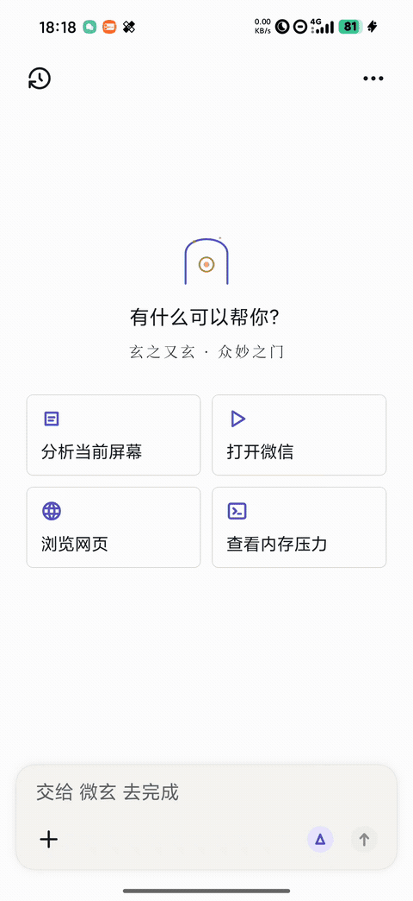

[简体中文](README.md) · **English**

# WeiXuan (微玄) · v0.0.1

> **Mystery upon mystery — the gateway to all wonders.** — *Tao Te Ching*, Chapter 1 (玄之又玄，众妙之门。)

**An AI agent that runs large language models offline on your phone's NPU.** It looks at your screen, taps for you, reads your files, and runs your commands — all on-device, with your data never leaving the phone.

---

## Table of Contents

- [Demo](#demo)
- [What It Can Do](#what-it-can-do)
- [Can My Phone Run It?](#can-my-phone-run-it)
- [Quick Start (4 Steps)](#quick-start-4-steps)
- [Usage Guide](#usage-guide)
- [Which Model to Pick](#which-model-to-pick)
- [Measured Performance](#measured-performance)
- [FAQ](#faq)
- [Developers: Building](#developers-building)
- [Tech Stack](#tech-stack)
- [Acknowledgements and License](#acknowledgements-and-license)

---

## Demo

| Tell your phone what to do | Tool calling |
|:---:|:---:|
|  |  |
| Say what you want; the model observes the screen and taps for you | The model decides which tools to call and reports each result |

*Entirely offline: inference, screen reading, tapping, and tool calls all happen on-device.*

---

## What It Can Do

In one sentence: **treat it as an assistant that lives on your phone — you state what you want, and it operates the phone itself to get it done.**

| Capability | Description |
|------|------|
| 💬 **Offline chat** | The model runs on your phone's NPU; works with no network, and conversations never leave the device |
| 👁️ **Understands the screen** | Reads the view hierarchy of the current screen (which button is where, what it says) and decides accordingly |
| 👆 **Operates the phone** | Tap / long-press / swipe / type text / go home — executed via the accessibility service |
| 📂 **Reads and writes files** | Read, write, list directories, and search inside the app's private workspace |
| ⌨️ **Runs commands** | Built-in terminal; a full Linux environment (Debian) can be installed on top (PRoot, no root needed) |
| 🌐 **Browser** | Built-in browser; the model can open pages and read their content on its own |
| 🧩 **Skills (tool calling)** | 50+ built-in tools, dynamically enabled according to the permissions you grant; the model decides which to call |
| 🎭 **Personas and memory** | Custom personas (system prompts) and long-term memory across sessions |
| 🔌 **MCP extensions** | MCP servers can be attached, exposing external tools to the model |
| 🎛️ **Visible parameters** | Decoding speed and first-token latency are shown live below each reply; temperature / top-p / context are adjustable |

> **Fully offline is the default state**: the app bundles no cloud model. If you prefer, you can add an OpenAI-compatible endpoint or Anthropic under "Model Providers" yourself (this feature is unused by default).

---

## Can My Phone Run It?

Core requirement: **Android 14 or later (arm64)**. The inference backend is selected automatically in this order:

| Your device | Backend | Status |
|----------|------|------|
| Snapdragon 8 series (Hexagon NPU) | **NPU (HTP)** | ✅ **Recommended**; backends for four HTP generations (v73/v75/v79/v81) are bundled, and v79 has been verified on a real device |
| Other arm64 phones (Dimensity / Kirin / older Snapdragon…) | **CPU** | ⚠️ It runs, but noticeably slower (about 1/3 the speed) |
| Adreno GPU (Vulkan) | GPU | ❌ **Outputs garbage**; verified unusable — use NPU or CPU instead |

### Do I need root? **No.**

Working without root is one of this project's design goals, not something it merely tolerates:

| Capability | Without root |
|------|---------|
| Local inference / chat / memory / browser / file tools | ✅ Fully available |
| Screen observation and tapping | ✅ Via the **accessibility service** (ordinary permission) |
| Terminal + Linux environment | ✅ Via **PRoot** (a user-space approach); with root it automatically upgrades to `chroot` |
| Model download and management | ✅ Fully available (without root, models land in an external directory and read slightly slower) |
| ~27 tools such as contacts / SMS / calls / gallery / logs / changing system settings | ❌ Require root; **they are automatically removed when unauthorised** rather than erroring out |
| System assistant takeover / XiaoAi hook | ⭕ Requires LSPosed (**optional enhancement; skipping it does not affect normal use**) |

> ✅ **No-root usability has been verified** (2026-10-04): after **revoking this app's root grant and disabling LSPosed**, the app inferred normally at a measured **prefill ≈615 t/s and decode ≈9.6 t/s** (NPU-class numbers; pure CPU reaches only about 4.2 t/s), with the full DSP call stack visible in-process (`libcdsprpc.so` + `libggml-hexagon-adapter.so` + `libqti_dsp_v1*.so`).
>
> ⚠️ Two caveats, stated honestly: ① the test device still had KernelSU installed, merely **without granting this app access** — the only difference from a factory non-rooted device is "`su` absent vs `su` denied", and both paths fall back through `runCatching` in this code, so behaviour is identical; ② without root the app cannot automatically clear background apps to free memory, so loading large models is more likely to be rejected by the memory pre-check — clear background apps manually to work around it.

📖 For the full device matrix, HTP generation table, quantisation format allow-list, and permission tiers, see [`docs/COMPATIBILITY.md`](docs/COMPATIBILITY.md).

**Memory is the hard threshold** (more critical than the chip model):

| Model size | Free memory required | On a 16GB device |
|----------|--------------|-----------|
| 0.6B ~ 1.7B | ≈ 1~2 GB | ✅ Easy |
| 4B (recommended) | ≈ 4 GB | ✅ Usually sufficient |
| 8B | ≈ 6 GB | ⚠️ Clear background apps first |

> A memory pre-check is built in: **when free memory is insufficient it refuses to load outright**, instead of dragging the phone into a freeze.
> There is also a temperature threshold: charging plus high temperature will block reloading a model.

📖 For a finer device / backend matrix, see [`docs/COMPATIBILITY.md`](docs/COMPATIBILITY.md).

---

## Quick Start (4 Steps)

### 1. Install

Build it yourself (see [Developers: Building](#developers-building)), or install the `app-debug.apk` you obtained:

```bash
adb install -r app-debug.apk
```

The first launch shows an onboarding screen explaining that your data never leaves the device.

### 2. Grant Permissions

Go to **Settings → Permissions** and enable what you need:

| Permission | What it is for | Required? |
|------|-----------|---------|
| **Accessibility service** | Lets the model "see the screen + tap" | Only needed for phone-operation features |
| Notification access | Read notifications | Optional |
| Usage access | Determine the foreground app | Recommended |
| Location | Time/location questions | Optional |
| Recording | Voice input | Optional |
| Storage | Import local model files | Only needed to import models |

**Enable only what you need** — every tool is gated by its corresponding permission, and tools you have not authorised are simply invisible to the model.

### 3. Download a Model

Go to **Settings → Local Models → Model Market** and start with **Qwen3-4B · Q4_K_M (2.38GB)**.

- It uses the system downloader and **supports background downloads and resumption** (large files keep downloading even with the screen off)
- You can also "Import locally": put a `.gguf` into the phone's `Android/data/cn.yangrq.weixuan/files/models/`
- On mainland Chinese networks, use the in-app download links (they already point at the hf-mirror mirror)

### 4. Load and Start Chatting

Once the download finishes, tap **Load**. The first load takes **15~25 seconds** (reading 2~4GB from storage, limited by storage speed) —
during which the chat screen shows "Loading local model, please wait". When loading completes:

1. Go back to the **Chat** page and type your first message, for example:
   - `What time is it?` (simple Q&A)
   - `Open WeChat for me` (requires the accessibility permission)
   - `What's on the screen?` (reads the screen's view hierarchy)
2. Below the reply you will see **tok/s** and first-token latency
3. When you want it to actually operate the phone, make sure the app is in the foreground or allowed to run in the background (a foreground service keeps it alive during execution)

---

## Usage Guide

### Chat

- The model **decides for itself** whether to call tools: simple questions are answered directly, and tool calls are issued only when operating the phone is needed
- A single request may involve multiple rounds (observe → act → observe again); complex tasks legitimately take longer
- If a reply contains "Loading local model", the engine is cold-starting — just wait

### Let It Operate Your Phone (Skills / Tools)

- Phrase things as you would say them daily: `turn on Bluetooth in Settings`, `type the weather into the search box`, `scroll down for more`
- Every step is logged in the conversation (which tool was called, with what arguments, and what came back)
- To have it do several things in a row, state them all at once: `open the gallery and tell me about the most recent photo`

### Terminal and Linux Environment

- The **Terminal** page executes shell commands directly
- For a full Linux, go to **Linux Environment** and install Debian (PRoot approach, **no root required**), after which common command-line tools can be installed
- Once permitted, the model can also invoke these commands (`run_command`)

### Model Management

- **Switch models at any time**: different models suit different tasks (lightweight ones are fast, larger ones are smarter)
- Models can be uninstalled to free memory; when unused, uninstalling them is recommended to leave the system headroom

### Run as an Inference Server

**One-liner: your phone *is* a private AI server — the model runs on-device, so your data never leaves the device.**

WeiXuan's built-in `llama-server` natively speaks the OpenAI-compatible API (`/v1/chat/completions`, `/v1/models`, ...). Turn on "Local inference server" and any app on the same phone — or any device on your LAN — can call the on-device model with a standard OpenAI API.

**How to enable**

1. Go to **Settings → Local inference server** (a dedicated secondary page);
2. Turn on the **Server mode** switch (off by default);
3. (Optional) pick **Bind scope**: `localhost 127.0.0.1` (default, safest) or `LAN 0.0.0.0` (visible to your Wi-Fi; an **API key is then mandatory**);
4. (Optional) change **port** (default `18787`), **concurrent slots** (default `1`) or the **API key**;
5. Tap **"Restart engine to apply"** so the listen parameters take effect;
6. Recommended: in the **"Keep-alive (background survival)"** section, tap **"Turn off battery optimization"**.

**Client usage**

| Item | Value |
|------|-------|
| base_url (localhost) | `http://127.0.0.1:18787/v1` |
| base_url (LAN) | `http://<phone-LAN-IP>:18787/v1` (send `Authorization: Bearer <key>`) |
| Model name | Use the `id` returned by `GET /v1/models` (usually the base name of the loaded `.gguf`) |

```bash
# One-line self-check: is the server up, and what is the model id?
curl -s http://127.0.0.1:18787/v1/models
```

**Capability boundaries (as-is, no marketing)**

| Item | Reality |
|------|---------|
| `-np 4` | **Not** 4x throughput. Each extra slot multiplies KV-cache memory and lowers per-stream speed; **`1` is recommended for personal use** |
| Single-stream speed | A 4B quantized model runs at roughly **9-17 tok/s** (varies with context length and device state) |
| Cold start | Loading a model takes seconds to tens of seconds; long prompts also need prefill time |
| Good for | Personal / low-frequency use, occasional LAN use by yourself or family, private APIs for other local apps |
| Not for | Many users hammering it concurrently, or server-grade sustained QPS |

**Background survival (keep-alive)**: when the server is on, WeiXuan uses a **foreground service + persistent notification + lightweight watchdog**; if the engine is killed while server mode is still on, it is auto-restarted (exponential backoff, gives up after 5 consecutive failures and notifies you). A wake lock is held **only while the engine is actually running** and self-expires. On Xiaomi / HyperOS you must **manually** set battery policy to *No restrictions*, allow **Autostart**, and lock the app in Recents.

Full client examples, measured concurrency notes, thermal protection, keep-alive details and FAQ: [`docs/SERVER_MODE.md`](docs/SERVER_MODE.md).

<!-- TODO: screenshot - the "Local inference server" settings page (with the keep-alive section) plus a successful `curl /v1/models` return -->

### Tuning Behavior

| Setting | Effect |
|--------|------|
| Context window | Larger remembers more, but costs more memory and is slower; the app selects it automatically based on memory |
| Temperature / top-p | Higher is more creative, lower is more stable |
| Thinking mode | Off answers directly (faster); on preserves the reasoning process |

---

## Which Model to Pick

The in-app "Model Market" offers the following **15** models across three tiers (sizes are measured values; all are one-tap downloads):

### Lightweight · Under 3B

| Model | Size | Best for |
|------|------|------|
| Qwen3-0.6B · Q4_K_M | 378 MB | Fastest responses, lowest memory — good for quick Q&A |
| Gemma-3-1B-it · Q4_K_M | 768 MB | Small footprint, basic Chinese and English Q&A |
| Qwen2.5-1.5B-Instruct · Q4_K_M | 940 MB | The strongest Chinese among the lightweight tier |
| Qwen3-1.7B · Q4_K_M | 1.06 GB | Light conversation, balancing speed and usability |
| DeepSeek-R1-Distill-Qwen-1.5B · Q4_K_M | 1.07 GB | Lightweight reasoning, thinking while answering |

### Mainstay · 3B ~ 4B (**Daily Recommendation**)

| Model | Size | Best for |
|------|------|------|
| Qwen2.5-3B-Instruct · Q4_K_M | 1.84 GB | The most memory-frugal of the mainstay tier; solid Chinese and instruction following |
| Llama-3.2-3B-Instruct · Q4_K_M | 1.93 GB | Lightweight English generalist |
| Gemma-3-4B-it · Q4_K_M | 2.38 GB | Balanced Chinese/English, natural multi-turn chat |
| Phi-4-mini-instruct · Q4_K_M | 2.38 GB | Strong at reasoning / maths |
| **Spark-X2.5-4B · Q4_K_M** | **2.42 GB** | ⭐ **Top pick**: agent-tuned; sliding-window attention keeps long contexts fast — measured **18 tok/s** on this device (text-only, no vision) |
| Qwen3-4B · Q4_K_M | 2.38 GB | The balanced choice: measured tool-calling accuracy above 80%, plus image input |

### Advanced · Above 4B (≈6GB Free RAM Required)

| Model | Size | Best for |
|------|------|------|
| DeepSeek-R1-Distill-Qwen-7B · Q4_K_M | 4.36 GB | Balanced reasoning power and speed |
| Qwen2.5-7B-Instruct · Q4_K_M | 4.36 GB | Strong Chinese writing and instruction following |
| InternLM2.5-7B-Chat · Q4_K_M | 4.39 GB | Long-form text and Chinese tool calling |
| DeepSeek-R1-0528-Qwen3-8B · Q4_K_M | 4.68 GB | The strongest reasoning in the 8B tier |
| Qwen3-8B · Q4_K_M | 4.80 GB | Quality first; solid Chinese and tool calling |

> **Selection criteria**: standard dense architecture (usable on NPU), Q4_K_M single file ≤4.8GB, working download source.
> MoE and linear-attention models were tested and **excluded** — the former is not viable on this device, the latter is structurally unsupported by the NPU,
> so they will not appear in the list.
> Some advanced entries have not yet been individually verified by loading on a real-device NPU; if one fails, please open an issue.

**One-line advice for new users: start with Spark-X2.5-4B.**

- Measured **18 tok/s** on this device (with **on-demand tool loading** enabled) — the fastest 4B-class model we have tested; it pulls further ahead as the context grows
- It is **text-only** (no vision). Its tool-calling accuracy is still being evaluated — fall back if you hit instability
- Alternative **Qwen3-4B**: measured **tool-calling accuracy exceeds 80%** on this device (26 real Chinese instructions) and it accepts image input
- Its 2.38GB size loads reliably on 16GB devices
- Want faster → switch to 1.7B / 1.5B; want smarter → move up to the advanced tier (clear background apps first)

---

## Measured Performance

The figures below are measured on a **Xiaomi 16GB device (Snapdragon 8 Elite Gen 5 / Hexagon NPU)** and vary with prompt length and temperature:

| Item | Measured |
|------|------|
| Decoding speed (**Spark-X2.5-4B + on-demand tool loading**) | **about 18 tok/s** ⭐ our fastest tested combination |
| Decoding speed (Spark-X2.5-4B, on-demand loading off, 5000+ token prompt) | about 9 ~ 10 tok/s |
| Decoding speed (Qwen3-4B) | **6 ~ 11 tok/s** (slower with longer prompts) |
| First token (prompt prefill) | about **600 ~ 1000 tok/s**; as low as **0.5 s** on a KV prefix hit |
| Prefix reuse | **99%** reuse within a session (later rounds prefill in only tens of milliseconds) |
| First model load | **6 ~ 25 seconds** (2~4GB read from storage; depends on storage bandwidth and device temperature) |
| Memory usage (4B) | about 2.9 GB (weights + vision tower + KV) |

> **What is "on-demand tool loading"?** WeiXuan ships 50+ tools, and it used to send every tool definition
> with every request (about 6000 tokens), dragging decoding down to roughly 4 tok/s. With it enabled only 16
> commonly used tools stay resident; the rest are **looked up by the model on demand and loaded automatically**,
> bringing the prompt down to about 3200 tokens — measured on this device: **decoding 4.2 → 14.5 tok/s, first
> token in 0.51 s, with no loss of tool capabilities**. Find it under **Settings → Tool capabilities → On-demand tool loading**.

**Why it gets slower the longer you chat**: each generated token requires reading the entire KV cache, and a longer context means more to read.
On this device we measured roughly **1.4 tok/s slower decoding per 1000 tokens of context**. That is why the context window setting is a trade-off between speed and memory.
(Spark-X2.5-4B uses sliding-window attention, so it degrades far less on long contexts — one reason it is faster here.)

---

## FAQ

**Q: It keeps saying "Loading local model"?**
Loading 2~4GB for the first time taking 15~25 seconds is normal. If it stalls for a long time, check whether there is enough free memory (the settings page shows a memory pre-check hint).

**Q: The model failed to load?**
Most likely insufficient free memory. Clear background apps and retry, or switch to a smaller model (4B → 1.7B).

**Q: Why won't it operate my phone?**
Check whether **Settings → Permissions → Accessibility service** is enabled. When unauthorised, the relevant tools are not offered to the model at all.

**Q: Can it work offline?**
Yes. After downloading a model, everything is offline — inference and tool calls all need no network.

**Q: The phone gets hot?**
Inference itself generates limited heat; **repeatedly loading models is the main heat source**. Avoid frequent unload/reload cycles, or step down to a smaller model.

**Q: Which model formats are supported?**
GGUF. Nine are built in for direct download; you can also import compatible GGUF files yourself.

---

## Developers: Building

```bash
./gradlew assembleDebug
# Output: app/build/outputs/apk/debug/app-debug.apk
```

Release build (signing + code shrinking, you must supply your own keystore):

```bash
export WEIXUAN_RELEASE_STORE_FILE=/path/to/your.jks
export WEIXUAN_RELEASE_STORE_PASSWORD=[REDACTED]
export WEIXUAN_RELEASE_KEY_ALIAS=...
export WEIXUAN_RELEASE_KEY_PASSWORD=[REDACTED]
./gradlew assembleRelease
# Output: app/build/outputs/apk/release/app-release.apk
```

> **APKs produced by `assembleDebug` are `debuggable=true` and use a debug signature — they are for self-testing only and must not be distributed.**
> For public releases use `assembleRelease` (which enables `minifyEnabled` + `shrinkResources`).

Requirements:

- Android Studio (AGP 9.3.2; the Gradle wrapper is bundled)
- Android NDK (version in `gradle/libs.versions.toml`) — the native runtime is cross-compiled from llama.cpp
- ≥ 8GB RAM on the build machine is recommended (Kotlin compilation is memory-hungry; when memory is tight you can set
  `kotlin.compiler.execution.strategy=in-process` in `gradle.properties` so the compiler shares Gradle's heap)

Repository layout:

```
app/src/main/kotlin/cn/yangrq/weixuan/
├── local/         Local inference: model catalog, memory ledger, llama-server hosting
├── agent/         Agent runtime: tool catalog, execution loop, model providers
├── ui/            Compose UI
└── ...
app/src/main/jniLibs/arm64-v8a/
├── libllama*.so   llama.cpp inference runtime (including multimodal libmtmd)
├── libggml-htp-v*.so   Hexagon NPU backends (v73/v75/v79/v81)
├── libggml-vulkan-adreno.so  Adreno GPU backend (experimental)
└── libproot_*.so  PRoot Linux environment support
```

---

## Tech Stack

| Layer | Choice |
|------|------|
| Language / UI | Kotlin · Jetpack Compose |
| Inference engine | A self-built [llama.cpp](https://github.com/ggml-org/llama.cpp) Android runtime (NDK cross-compiled, hosted in a separate process with an OpenAI-compatible local API) |
| Compute backends | **Hexagon NPU (HTP) first**, automatic CPU fallback, Adreno GPU (Vulkan) experimental |
| Model format | GGUF (Qwen3 / Gemma-3 / Phi-4 / Llama-3.2 / DeepSeek-R1 distills) |
| Device control | Accessibility service + foreground service lease |
| Terminal | PRoot (user-space Linux, no root required) |

---

## Acknowledgements and License

WeiXuan stands on the shoulders of these excellent open-source projects — among them, **[Eta](https://github.com/Mangi-11/Eta) is this project's upstream base**, and the bulk of WeiXuan's work is built on top of it:

- [Eta](https://github.com/Mangi-11/Eta) (**PolyForm Noncommercial 1.0.0**, noncommercial) — **upstream base**: a system-level AI assistant framework. WeiXuan's architecture, interaction paradigm, and much of its implementation come from it
- [llama.cpp](https://github.com/ggml-org/llama.cpp) (MIT) — on-device LLM inference engine; this project's self-built runtime is cross-compiled from its source via the Android NDK
- [google-ai-edge/gallery](https://github.com/google-ai-edge/gallery) (Apache-2.0) — basis for the model management UI
- [Tabler Icons](https://github.com/tabler/tabler-icons) (MIT) — functional icon foundation (inlined as ImageVectors, see `ui/design/tabler/`)
- Qualcomm GenieX / QAIRT — Hexagon NPU runtime; this project reuses its Hexagon backend shared libraries to reach the HTP
- [Qwen3](https://github.com/QwenLM/Qwen3) (Apache-2.0) · [Gemma](https://ai.google.dev/gemma) · [Phi](https://huggingface.co/microsoft) · [Llama](https://www.llama.com/) · [DeepSeek-R1](https://github.com/deepseek-ai/DeepSeek-R1) — models and quantisations come from their respective authors

Full third-party notices (including licence texts) are in [`docs/THIRD_PARTY_NOTICES.md`](docs/THIRD_PARTY_NOTICES.md).

This project is released under the **[PolyForm Noncommercial License 1.0.0](LICENSE)** — free to use, modify and distribute for personal, research and other **noncommercial** purposes.

> ⚠️ **An honest note on licensing**: WeiXuan is a derivative work of [Eta](https://github.com/Mangi-11/Eta), which is itself licensed under PolyForm Noncommercial 1.0.0. As a derivative work, WeiXuan **must keep the noncommercial licence**, so this project **is not** OSI open source (source-available, not open source). For commercial use, please obtain permission from both the upstream author and this project's author.
